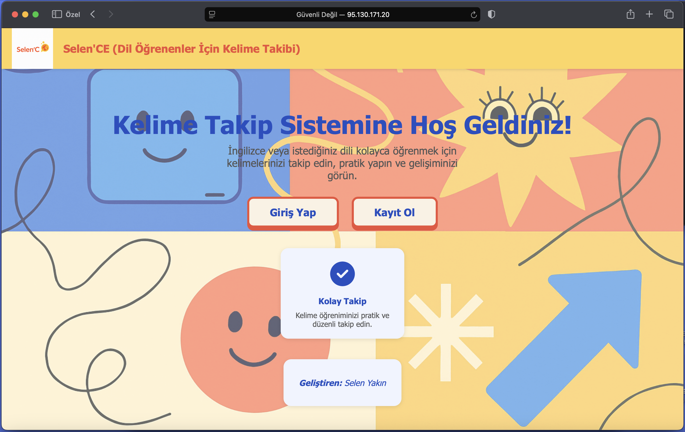
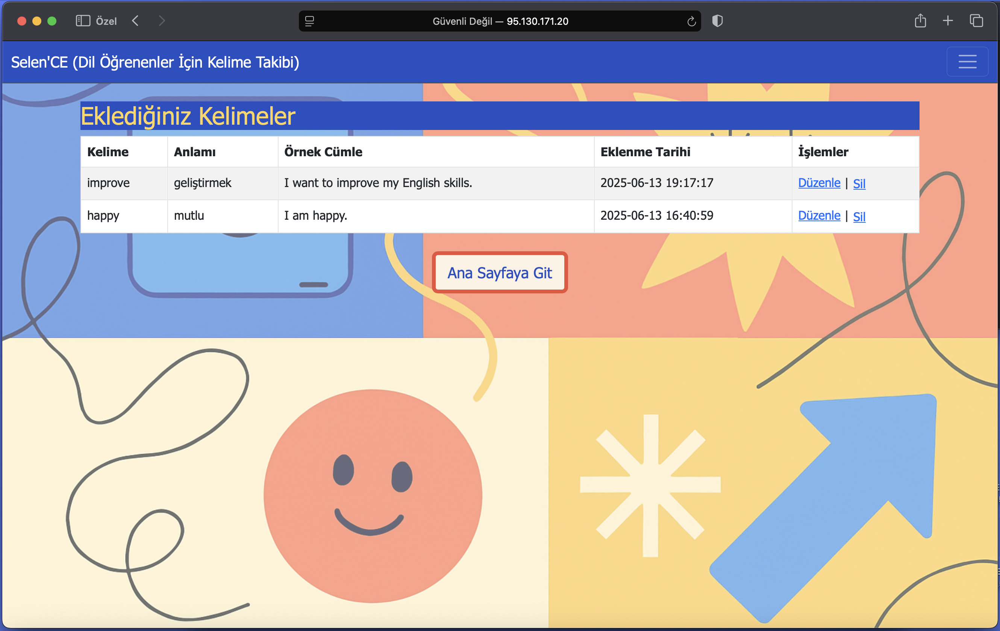

# 📚📝 Dil Öğrenme Kelime Takip Sistemi 🌐🔤

Bu proje, “Web Tabanlı Programlama” dersi kapsamında PHP ve MySQL kullanılarak hazırlanmış bir uygulamadır.  
Dil öğrenme sürecinde kullanıcıların kelimelerini takip edebilmeleri, ekleyebilmeleri ve yönetebilmeleri amaçlanmıştır.  
Güvenli kullanıcı kayıt ve giriş sistemi ile kelime listelerinin yönetimi sağlanmaktadır.  
Ön yüzünde Bootstrap kütüphanesi kullanılarak kullanıcı dostu bir arayüz tasarlanmıştır.

---

## 🚀 Proje Özellikleri  
- **Kullanıcı Kayıt ve Giriş:** Kolayca kayıt ol, güvenle giriş yap!  
- **Kelimelerim:** Öğrendiğin kelimeleri listele, düzenle veya sil.  
- **Kelime Ekle:** Yeni kelimeler, anlamları ve örnek cümlelerle hızlıca ekle.  
- **Profilim:** Kullanıcı bilgilerini görüntüle ve yönet.  
- **Çıkış:** İşin bittiğinde güvenli çıkış yap.  

---

## 🛠️ Teknolojiler  
- PHP  
- MySQL  
- Bootstrap  
- HTML / CSS / JavaScript

---

## ⚙️ Kurulum  
1. Repoyu klonlayın veya ZIP dosyasını indirin.  
2. MySQL üzerinde veritabanını ve tabloları oluşturun (SQL dosyası projede).  
3. `config.php` dosyasını kendi veritabanı bilgilerinize göre düzenleyin.  
4. Projeyi web sunucusuna yükleyin (XAMPP, WAMP veya hosting).  
5. Tarayıcıda projenin ana dizinine gidip kullanmaya başlayın!

---

## 🌐 Canlı Demo  
Projeyi hemen deneyin:  
[http://95.130.171.20/~st23360859034/proje/](http://95.130.171.20/~st23360859034/proje/)

---

## 🎥 Tanıtım Videosu  
Proje hakkında daha fazla bilgi için videomu izleyebilirsiniz:  
[YouTube Video Linki](https://youtu.be/jT5eEpqPtoc)

---

## 📸 Ekran Görüntüleri  
  
*Web sitesinin Anasayfası*

  
*Kelimelerim sayfasında kayıtlı kelimeler*

---

## 👩‍💻 Hazırlayan  
Selen Yakın
